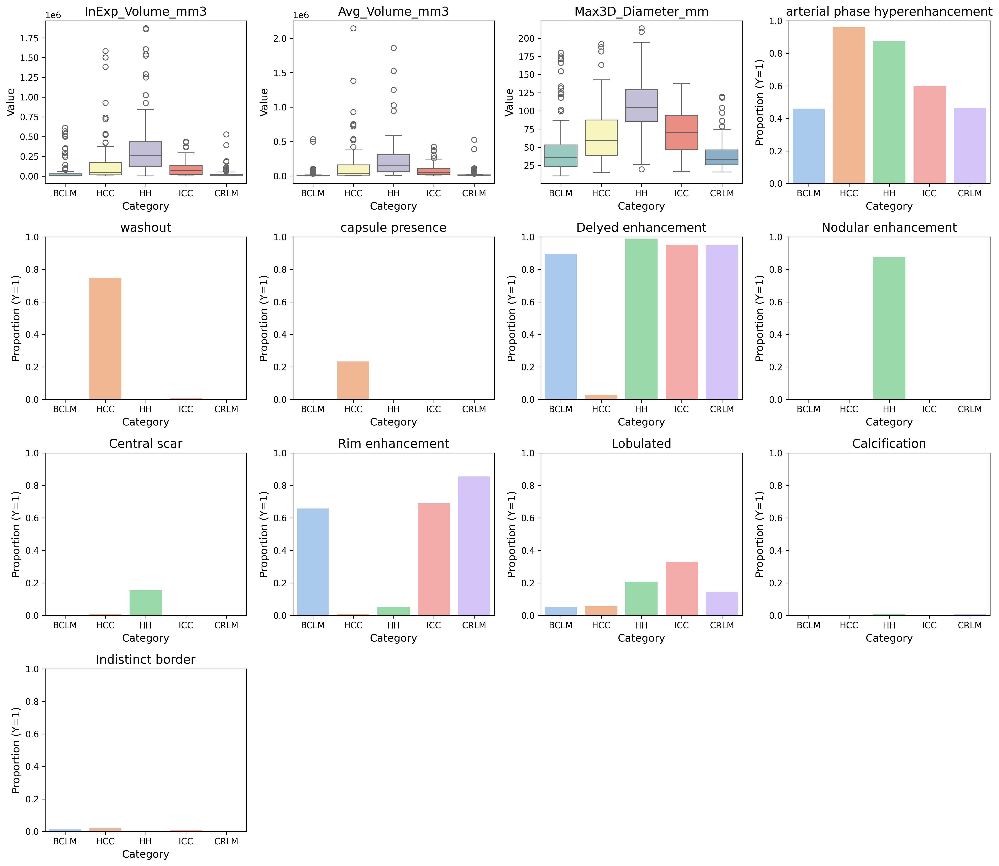

# MCT-LTDiag
📝 A code repository developed for benchmark construction on differential diagnosis of liver tumors.

[Code](https://github.com/Hoyant-Su/Multi-phase_LT_Benchmark) | [Model](https://github.com/Hoyant-Su/RU-Net) | [Dataset](https://doi.org/10.7910/DVN/S3RW15) | [Huggingface](https://huggingface.co/datasets/Hoyant-Su/MCT_LTDiag_dataset)


## What's New
- [2025-10] An updated version `2.0` of the MCT-LTDiag dataset has been released on Harvard Dataverse, including anonymized raw DICOM images and the following newly added metadata: tumor-level features (InExp_Volume_mm3, Avg_Volume_mm3, Max3D_Diameter_mm, arterial phase hyperenhancement, washout, capsule presence, delayed enhancement, nodular enhancement, central scar, rim enhancement, lobulated, calcification, indistinct border) and patient-level features (patient_age, cirrhosis status, history of viral hepatitis, history of chemotherapy).
- [2025-09] Released the first version of our specialized liver tumor classification model **RU-Net**, trained on **MCT_LTDiag**.  👉 [Model Link](https://github.com/Hoyant-Su/RU-Net)
- [2025-05] Officially released our liver tumor NIfTI dataset on the Harvard Dataverse platform.  👉 [Dataset Link](https://doi.org/10.7910/DVN/S3RW15)

## Environment Setup

⚙️ Follow the steps below to set up the PyTorch environment required for this project:

```bash
cd Multi_phase_liver_tumor_benchmark
conda env create -f environment.yml
conda activate LT_benchmark
```


## Dataset Download
The dataset can be accessed at 👉 [Dataset Link](https://doi.org/10.7910/DVN/S3RW15)

### Metadata Overview
<p align="center">
  
  
</p>

We provide a script to demonstrate how to **download and extract our dataset from Harvard Dataverse** using Google Drive.

To use it:

1. Obtain your API Token in Harvard Dataverse.
2. Open Google Colab.
3. Run the code blocks in `MCT_LTDiag_download.ipynb` in order.
4. The notebook will automatically download all dataset files, extract `.tar` archives, and save them to your specified Google Drive folder.
- NOTE for Windows users: `.tar` files can be extracted using 7-Zip or other archive tools.


<!-- The dataset, along with feature and label files with `.csv` and `.txt` suffixes, can be accessed at 👉 **[Dataset Repository]()** -->

## Data Preparation
🗂️ Prepare the data in the following structure:
```bash
Data/
  └── mask/
    ├── tumor_type/
      ├── case1/
        ├── mask_pvp.nii.gz
      ├── .../
    ├── .../
  └── volume/
    ├── tumor_type/
      ├── case1/
        ├── phase1.nii.gz
        ├── phase2.nii.gz
        ├── ...
      ├── .../
    ├── .../
    
Label/
  └── exp/
    └── <exp_name>/<exp_date>/ # Experiment directory with name and date
      ├── fold_1_xxx.csv 
      ├── fold_2_xxx.csv 
      └── ... 
```


## Data Preprocessing Pipeline
Here we present a standardized data preprocessing workflow with executable scripts, comprising two core components:

### 📦 Multi-phase Registration Protocol
```text
 Input: NC, AP, DP phase scans  
 Process: Multiphase registration using ITKElastix (v0.20.0)
          Hierarchical B-spline deformation
 Output: PVP-phase aligned volumes
```

### 📦 AI-driven Segmentation Workflow
processing steps: Model mask generation -> Expert refinement -> VOI extraction

Here we provided workflow related scripts `regis.py`, `seg_for_mask.py`, `VOI_extraction.py` to ensure reproducibility.

Comprehensive flowchart can be referred: 


## Benchmark and Implementation
We follow existing literature on liver tumor diagnosis to implement model architectures that have proven effective for differential diagnosis of liver tumors. Follow the instruction bellow to run the implementation codes.
### Training & Validation
```bash
# Machine Learning Baseline
python radiomics_extract_classification/train_random_forest_K_fold.py
# Deep Learning Baseline
bash dl_classification/do_train_liver_parallel.sh
```
### Testing
```bash
# Machine Learning Baseline
python radiomics_extract_classification/test_random_forest_K_fold.py
python radiomics_extract_classification/train_svm_K_fold.py
# Deep Learning Baseline
bash /dl_classification/do_test_liver_K.sh
```


## Contributing Institutions

The following institutions have contributed to the development of this project:

<p align="center">
  
  
  
  
</p>

## Citation
```
@data{DVN/S3RW15_2025,
author = {Haoyang Su},
publisher = {Harvard Dataverse},
title = {{MCT-LTDiag}},
year = {2025},
version = {V1},
doi = {10.7910/DVN/S3RW15},
url = {https://doi.org/10.7910/DVN/S3RW15}
}
```
